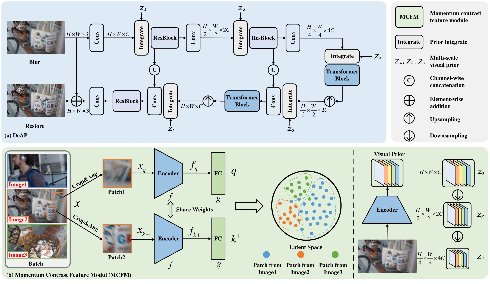

# DeAP: Learning Degradation-aware Prior for Image Deblurring

#### Note
Complete code and pre-trained models will be released!

<hr />

> **Abstract:** *While image deblurring techniques have made significant progress recently, they still face challenges in simultaneously handling a variety of complex blur types caused by camera shake, object movement, or a combination of both. In this paper, we propose a novel framework to learn degradation-aware prior for image deblurring, termed DeAP. Inspired by the success of contrastive learning in representation learning, this framework incorporates a momentum contrast feature module (MCFM) to explore image-level degradation-aware knowledge as visual priors, which model diverse blur types. Additionally, our DeAP embeds the resulting visual priors into hierarchical features in a unified manner, providing multi-scale degradation-aware knowledge for image deblurring. Extensive experiments are conducted on three widely-adopted datasets, including GoPro, HIDE, and RealBlur. The experimental results show that our DeAP achieves state-of-the-art performance (e.g., 33.82 dB in PSNR on GoPro dataset).* 
<hr />

## Installation
```
cd DeAP
conda create -n DeAP python=3.9.19
source activate DeAP
conda install pytorch==1.13.0 torchvision==0.14.0 torchaudio==0.13.0 cudatoolkit=11.7 -c pytorch -c conda-forge
pip install opencv-python tqdm glog scikit-image albumentations
pip install -U albumentations[imgaug]
pip install albumentations==1.1.0
```
## Network Architecture


## Training and Testing
### 1. Data Preparation
Download "[GoPro](https://drive.google.com/drive/folders/1BdV2l7A5MRXLWszGonMxR88eV27geb_n?usp=sharing)" dataset into './datasets' </br>
For example: './datasets/GoPro'
### 2. Training
* The training script uses 8 GPUs by default.
* Run the following command
```
sh run.sh
```
### 3. Testing
**For testing on GoPro/HIDE dataset** </br>
* You should modify the image path in train_config.py. </br>
* Run the following command
```
python tools/eval.py
```
**For testing on RealBlur-J/RealBlur-R dataset** </br>
* You should modify the image path in train_config.py. </br>
* Run the following command
```
python tools/eval_real.py
```
## Evaluation
Before you evaluate, you should download the results into './out'.
* For evaluation on GoPro/HIDE results in MATLAB, Run the following command
```
evaluation_gopro_hide.m
```
* For evaluation on RealBlur results, Run the following command
```
python tools/evaluate_realblur.py
```
## Acknowledgment
This repo is build upon [Stripformer](https://github.com/pp00704831/Stripformer-ECCV-2022-). We acknowledg these excellent implementations.